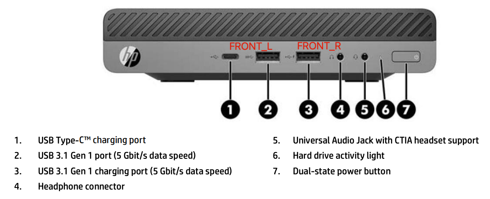
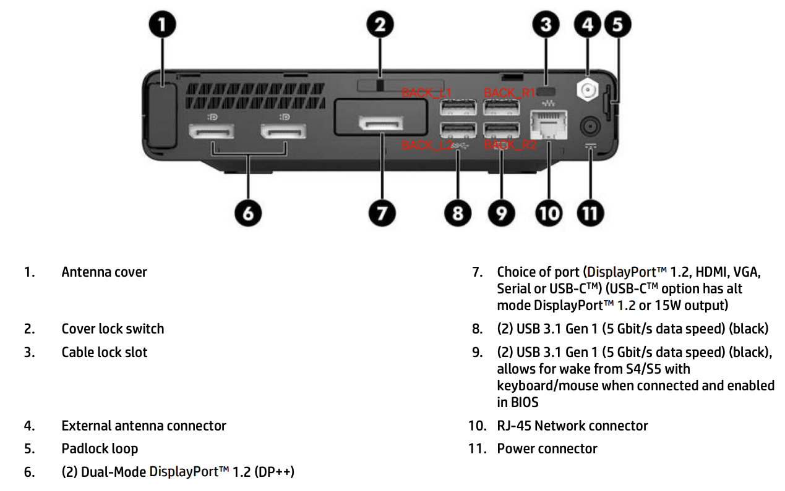

# OpenCore Hackintosh on HP EliteDesk 800 G3 

This is a repository where I store files that were configured to run macOS properly on HP EliteDesk 800 G3.

>**Disclaimer**: I do not own any responsibilities if your PC running into problems by patching the files or applying the guide here. Please do your own research.

## PC specifications 🧾

Figure 1. Front face of model

 

Figure 2. Back face of model

 

<b>SPECIFICATIONS TABLE</b>

| NAME |  DESCRIPTION |
|------|:-----------:|
| Model name | HP EliteDesk 800 G3 Desktop Mini Business PC (35W) |
| OS | macOS Ventura 13.6 |
| CPU | Intel Core i5-7500T |
| Memory | 16GB (8GB x 2) DDR4 2400 MHz |
| Graphics | Intel HD Graphics 630 |
| Wi-Fi | Broadcom BCM94360CS |

##  BIOS SETUP 💾

>**Required**: Please reset your BIOS to default settings before this

- **Advanced &rarr; Boot Options**

    - Disable **Fast Boot**
    - Enable **USB Storage Boot**
    - UEFI Boot order, place your bootable macOS installation USB on the first row otherwise you will need to choose it when system restarts by pressing **F10** &rarr; your USB.
    - Other settings remain default

- **Advanced &rarr; Secure Boot Configuration**

    - Select **Legacy Support Disable and Secure Boot Disable**
    - Other settings remain default

- **Advanced &rarr; System Options**

    - Enable **Virtualization Technology (VTx)**
    - Disable **Virtualization Technology for Directed I/O (VTd)**
    - Enable **M.2 SSD** if you're using a NVME SSD
    - Check **M.2 WLAN/BT** (Uncheck it if have interruption issues)
    - Check **Allow PCIe/PCI SERR# Interrupt** (Uncheck it if have interruption issues)
    - Other settings remain default

- **Advanced &rarr; Built-in Device Options**

    - Disable **Wake on LAN**
    - Set **Video memory size** to **64MB** or larger
    - Disable **LAN/WLAN Auto Switching**
    - Disable **Wake on Wake on USB**
    - Other settings remain default

>**Notice**: Make sure to save your settings before restarting

